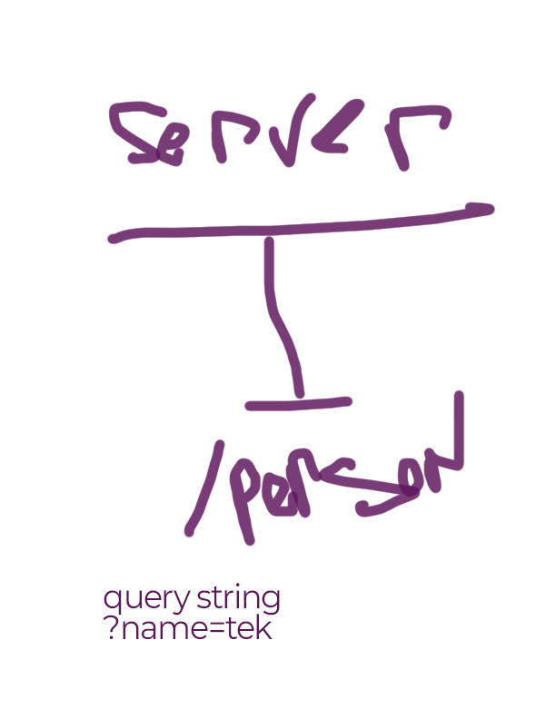

# basic-express-server
core, standards compliant Express server

## Author: Tek Jones

## Deployment
- Development: https://tekjones-basic-express-server.herokuapp.com/

## Setup
- .env requirements
- PORT - Port Number

## Running the app
- npm start

## test
- npm test

## Routes

### /person
- query string + ?name=tek
- object response {name: tek}

